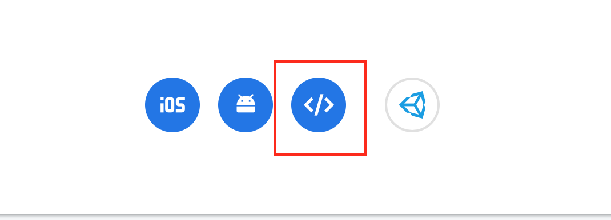

# polished 

[](https://www.tidyverse.org/lifecycle/#maturing) [](https://travis-ci.org/tychobra/polished)

Authentication and user administration for Shiny apps.  `polished` provides a way to secure your Shiny application behind an authentication layer.  It also provides a UI for controlling user access. 

Sign in to a [Live Demo Shiny App](https://tychobra.shinyapps.io/polished_example_01) with the following:

 - email: demo@tychobra.com
 - password: polished

Check out the [introducing polished blog post](https://www.tychobra.com/posts/2019_08_27_announcing_polished/) for a high level overview and video.

Warning: there will be many breaking changes before this package matures to version 1.0.0

### Requirements

- R
- one or more Shiny apps
- a [Firebase](https://firebase.google.com/) account
- a PostgreSQL database

### `polished` installation

```
# R

remotes::install_github("tychobra/polished")
```

**NOTE:** If you already have an older version of the package `shinyFeedback` installed, be sure to install the latest CRAN version when prompted by the install above or Polished **will not work**

### Initial Set Up

1. Set up your Firebase project at [https://firebase.google.com/](https://firebase.google.com/).  Open your new Firebase project and:
   - go to the "Authentication" page "Sign-in method" tab and enable "Email/Password" sign in. See the below screenshot:
   

2. Set up PostgreSQL "polished" schema.  This schema stores your users, apps, and information about which users are authorized to access which apps.  To create this schema you must have a PostgreSQL database that you can connect to.

```
# R

# connect to your PostgreSQL database
db_conn <- DBI::dbConnect(
  RPostgres::Postgres(),
  <your db connection credentials>
)

# If this is your first Shiny app using polished, create the "polished" schema.
# Warning: if you already have a polished schema this function will overwrite your existing schema with empty tables.
polished::create_schema(db_conn)
```

3. Secure Your Shiny App

Get the following credentials from your Firebase project: 
  - apiKey
  - authDomain
  - projectId
  
**NOTE:** To find the above credentials, click on the `Add Web App` button at the bottom of General Settings (shown in the screenshot below outlined in red). Register the App (you do NOT need to check the box for "Also set up Firebase Hosting for this app"), and back at the bottom of the General Settings page your Firebase credentials will be where the "Add Web App" button was.  



Then you will need to execute the `global_sessions_config()` in "global.R", pass your Shiny ui to `secure_ui()`, and your Shiny server to `secure_server()`.  See the documentation of `global_sessions_config()`, `secure_ui()`, and `secure_server()` for details. 

4. Invite the first user to your app

At this point, when you run your app you should see the sign in page. e.g:

<p align="center">
 
</p>

But, if you enter your email and click "Continue", you will see a "Not Authorized -
You must have an invite to access this app" alert.  By default polished requires users to first be invited before they can access your app.

You can invite yourself (and other users) to access your app by running the app locally in "admin_mode".  To run the app in "admin_mode", set the "admin_mode" argument of `global_sessions_config()` to `TRUE` and restart your R session (make sure to set the "admin_mode" argument back to `FALSE` before you deploy your app!).  When you run your Shiny app in "admin_mode" you will be taken directly to the polished Admin Panel without having to sign in.  You can then go to the "User Access" tab to invite users.  e.g.


Enter the email address of the user you want to invite to your app.  


If you set the "Is Admin?" radio button to "Yes", the user will have access to
your Shiny app and the `polished` Admin Panel (i.e. the user will be able to invite additional
users and remove existing user from your app).  If "Is Admin?" if set to "No", the user will
be able to access your Shiny app, but they will __not__ have access to the `polished` Admin Panel; non admins are not authorized to invite/remove users.

Once the user has been added, restart the app and register the new user on the Polished sign in page. After registration, you'll be sent a verification email, and you will be redirected to an email verification page. Once the link in the verification email has been clicked, you will be redirected to your Shiny app!

You can find a few full working examples and examples of various configuration options in [polisehed_examples_repo](https://github.com/Tychobra/polished_example_apps).  
